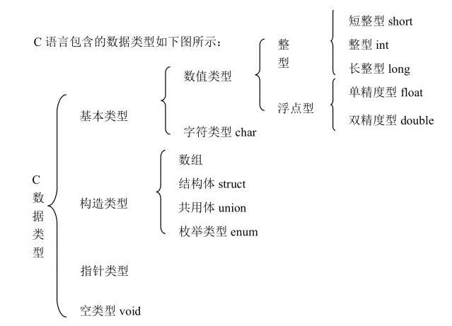

# the study of C

**C语言学习笔记**

主要学习资料如下：
* 程序员联盟-谢恩铭：https://www.jianshu.com/nb/4555196

## 目录

* [变量](#变量)
* [运算](#运算)
* [条件表达式](#条件表达式)
* [练习小脚本](Scripts)

## [变量](#目录)

### 变量类型



### 变量声明

```C
#include <stdio.h>
#include <stdlib.h>

int main(int argc, char *argv[])
{
    int numberOfDogs;
    int growthOfEconomy;
    double averageSalary;
    unsigned int numberOfDogs;
    int numberOfCats, numberOfMouses;

    numberOfDogs = 7; // 有七条狗
    return 0;
}
```

### const关键字

constant（恒定的，不变的）变量由const关键字修饰

```C
const int NUMBER_OF_DOGS = 7;
//在之后的程序中改变const变量的值，编译器会提示一个错误
```

### 显示和输入变量

* **printf**: 显示变量

```C
#include <stdio.h>
#include <stdlib.h>

int main(int argc, char *argv[])
{
    int numberOfDogs = 5, numberOfCats= 6; // 一开始，你有5只狗和6只猫

    printf("你有 %d 只狗，还有 %d 只猫\n", numberOfDogs, numberOfCats);
    printf("**** 跑了一只狗 ****\n");
    numberOfDogs= 4; // 刚跑了一只狗，只有4只了
    printf("啊呀，你只剩下 %d 只狗了\n", numberOfDogs);

    return 0;
}
```

* **scanf**: 提取用户输入的值，并将其储存到变量里面。  
Note: 对于float和double来说，printf里面他们的替代符号都是%f， 但是在scanf里面却不一样. 在scanf中，float是%f，而double是%lf.

```C
int main(int argc, char *argv[])
{
    int sum = 0; // 把钱数初始化为零

    printf("你身上有多少钱 ? ");
    scanf("%d", &sum); // 请求用户输入钱数
    printf("你有 %d 块钱啊，那还不快快地交出来 !\n", sum);

    return 0;
}
```
## [运算](#目录)

### 基本元算
| 运算 | 符号 | 备注 |
|-----|-----|-----|
| 加 | + |
| 减 | - |
| 乘 | * |
| 除 | / |整数相除和浮点数相除需要注意|
| 取模 | % |

### 变量运算

```C
int number = 2

number++ //自增运算: 结果+1操作
number-- //自减运算

number += 4; // number变为6
number -= 3; // number变为3
number *= 5; // number变为15
number /= 3; // number变为5
number %= 3; // number变为2 （因为 5 = 1 * 3 + 2）
```

### 数学库

```C
# include <math.h> //调用数学包

//fabs: 返回绝对值
double absolut = 0, number = -29;
absolut = fabs(number); // absolut的值变为29

//ceil: 舍入紧邻的比参数大的整数
double above = 0, number = 34.81;
above = ceil(number); // above的值变为35

//floor: 舍入紧邻的比参数小的整数
double below = 0, number = 45.63;
below = floor(number); // below的值变为45

//pow: 计算数字的乘方,要给它两个参数：底数和指数
double result = 0, number = 2;
result = pow(number, 4); // result的值变为16 （2 ^ 4 = 16）

//sqrt: 返回平方跟
double result = 0, number = 100;
result = sqrt(number); // result的值变为10

//sin, cos, tan
//asin, acos, atan
//exp: 返回以e（自然对数的底数，近似等于2.7182）为底数的指数运算的值
//log: 返回以e为底的对数值（我们学数学时也写成ln）
//log10: 返回以10为底的对数值
```

## [条件表达式](#目录)

### 预备符号

| 运算 | 符号 |
|-----|-----|
| 相等 | == |
| 大于 | > |
| 小于 | < |
| 大于等于 | >= |
| 小于等于 | <= |
| 不等于 | != |

### 单一if-else语句

```C
if () //判断条件
{
  // 条件为真的时候，所要执行的操作
}
else // 如果上面()里的条件为假
{
  // 条件为假的时候，所要执行的操作
}
```

例子如下:
```C
#include <stdio.h>

int main(int argc, char *argv[])
{
  int age = 20;

  if (age >= 18) // 如果age变量的值大于或等于18
  {
    printf ("你成年了!");
  }
  else // 如果age变量的值小于18
  {
    printf ("你还未成年，可以任性!");
  }
```

### else-if语句

例子如下:
```C
if (age >= 18)  // 如果age（英语：年龄）变量的值大于或等于18
{
  printf ("你成年了 !");
}
else if ( age > 4 )  // 如果age小于18但是大于4
{
  printf ("还好你不是太年幼");
}
else // 如果age小于或等于4
{
  printf ("mama, guagua, blablabla...");  // 儿语，听不懂
}
```
### 多个判断

```C
// 逻辑与
if (age > 18 && age < 25)

// 逻辑或
if (age > 20 || money > 150000)
{
  printf("欢迎来到**银行 !");
}
else
{
  printf("我还不够资格，悲催啊 !");
}

// 逻辑非
if (!(age < 18))

// 多个连用
if ((age > 18 && age < 25) || age < 4)
```
### 布尔类型

布尔类型英语叫boolean，是只能取“真”或者“假”的一种变量类型。

在其他的一些编程语言，如Java，C++，C#中，本身定义了boolean类型，只能有两个值，true（真）和false（假）。**C语言把零作为假，非零的一切值都算为真**

```C
if (1)
{
  printf("真!");
}
else
{
  printf("假!");
}
```

### switch语句

例子如下:
```C
#include <stdio.h>

int main(int argc, char *argv[])
{
  int choiceMenu;

  printf("=== 菜单 ===\n\n");
  printf("1. 北京烤鸭\n");
  printf("2. 锅包肉\n");
  printf("3. 地三鲜n");
  printf("4. 梅菜扣肉\n");
  printf("\n您的选择是 ? ");
  scanf("%d", &choiceMenu);

  printf("\n");

  switch (choiceMenu)
  {
    case 1:
      printf("您选了北京烤鸭。这是本店的招牌菜 !");
      break;
    case 2:
      printf("您选了锅包肉。您是东北人吧?知道宋佳吗?她最喜欢吃锅包肉了!");
      break;
    case 3:
      printf("您选了地三鲜。实惠好吃，就是油有点多.");
      break;
    case 4:
      printf("您选了梅菜扣肉。嗯，那个味道很棒!");
      break;
    default:
      printf("您没有选择餐单上的数字，难道您要饿肚子吗 ?");
      break;
  }

  printf("\n");

  return 0;
}
```

### 三元表达式: 精简的条件语句

```C
// (条件) ? "1"对应的结果 : "0"对应的结果
age = (adult) ? 18 : 17;
```
